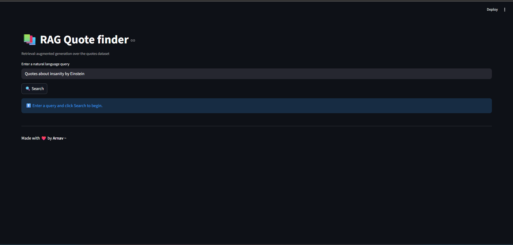
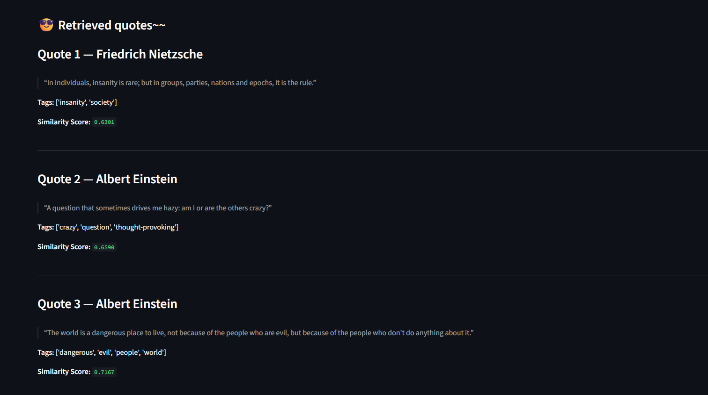
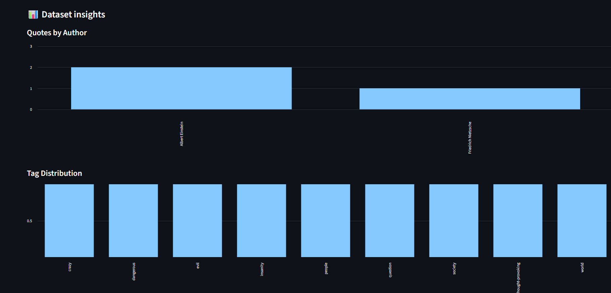

<div align="center">

# 📚 RAG Quote Finder  
### Retrieval-Augmented Generation over quotes dataset

</div>

---

##  Demo Video

▶️ **Walkthrough**  
https://youtu.be/zVL5Hq1mDPI

 The demo shows:
- Full code walkthrough
- Streamlit UI demo
- Structured JSON output + download
- RAG evaluation
- Dataset visualizations

---


## Project Overview

This project implements a **Retrieval-Augmented Generation (RAG)** pipeline using the  
**Abirate/english_quotes** dataset from HuggingFace.

## How to run the project locally

### 1. clone/download the Project

Place the project folder on your pc.

### 2. create and activate a Virtual Environment

```bash
python -m venv venv
venv\\Scripts\\activate  
```

### 3. install the requirements

```bash
pip install -r requirements.txt
```

### 4. set Environment Variables

Create a `.env` file in the root directory:

```
GOOGLE_API_KEY=your_api_key
```
### 5. Run data preparation & indexing (One-Time)

```bash
python data_preparation.py
python build_embeddings.py
python build_faiss.py
```

### 5. run the streamlit apllication in terminal

```bash
streamlit run app.py
```

## Application Screenshots

### Streamlit Home Page



### Structured JSON Output+ download


### Retrieved quotes page 



### Visualizations page



---

## Architecture Overview

### RAG Flow

```text
User Query (Streamlit UI)
        ↓
Sentence Transformer (Query Embedding)
        ↓
FAISS Vector Index (Similarity Search)
        ↓
Top-K Relevant Quotes (Context)
        ↓
Gemini LLM (Context + Query)
        ↓
Answer + Sources + Structured JSON Output
```

---

## Requirements

 project uses the following  dependencies:

* Python 3.10+
* Streamlit
* Dataset	HuggingFace – Abirate/english_quotes
* Sentence-Transformers (all-MiniLM-L6-v2)
* Vector Database	FAISS
* Google Gemini
*RAG Evaluation	RAGAS

All are listed in `requirements.txt`, just run the file.

## RAG evaluation is performed using RAGAS.
Run Evaluation
```bash
python rag_evaluation.py
```

## Design Decisions

### Why Sentence Transformers?

* Lightweight and fast

* Strong semantic similarity

* Ideal for short text like quotes

### Why FAISS?

* Extremely fast vector search

* Scales efficiently

* Industry-standard for rag systems

### Why Gemini?

* Free API access

* fast inference

* Easy integration into GenAI workflows

### Why Structured JSON Output?

* Required for RAG evaluation

* Downloadable results

* Production-ready format

### Why Streamlit?

* Rapid UI development

* Clean interactive demos

* Ideal for fast showcases

## ⚠️ Challenges Faced

* CUDA vs CPU tensor loading issues

* Gemini model availability mismatches

* Finetuning model over small dataset

* Streamlit rerun & session handling

## ✅ Solutions

* Explicit device handling

* Correct Gemini model selection

* used pretrained minilm `( task-specific adaptation )`

* Modular pipeline separation
  
##  Conclusion

This project demonstrates a complete, real-world Retrieval-Augmented Generation system:

* ✔ Data preparation
* ✔ Embedding & indexing
* ✔ Retrieval
* ✔ Generation
* ✔ Evaluation
* ✔ Visualization
* ✔ User-friendly UI

